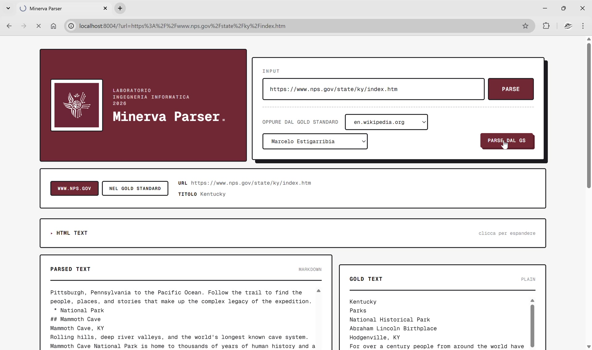
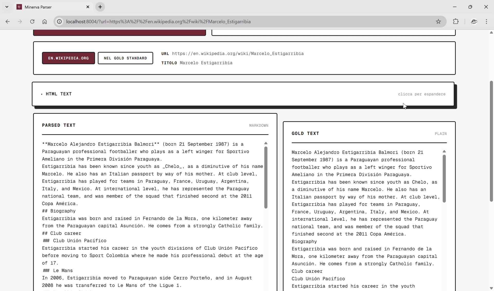
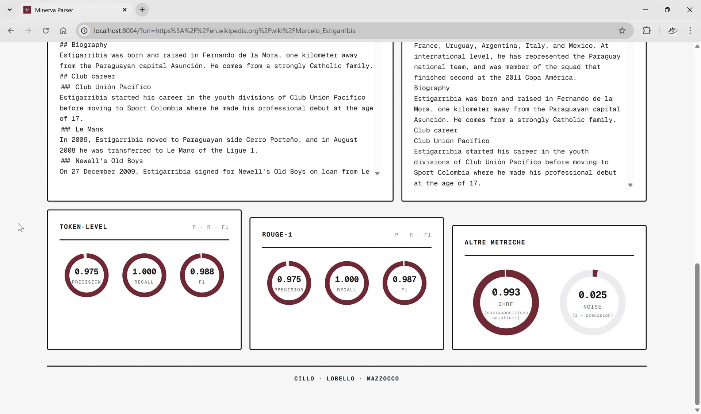

# Minerva Parser

> An end-to-end pipeline that acquires and analyzes documents from heterogeneous web sources — a data-acquisition component for the Italian national LLM **Minerva**.

## Overview

Given the URL of a page from one of the supported domains, **Minerva Parser** downloads the page, extracts only its informative content as clean **Markdown**, and compares it against a hand-built **Gold Standard (GS)**. The result is exposed through a **REST API**, with a minimal **web UI** for inspecting parses and their evaluation.

The project was developed for the *Laboratorio di Ingegneria Informatica* course at **Sapienza University of Rome**. It is intended as a data-acquisition stage for **Minerva**, the Italian national LLM developed by Sapienza NLP and Babelscape: the same kind of pipeline that lets a chatbot search the web, parse the retrieved pages, and ground its answers on up-to-date content.

## Demo

The web UI lets you parse a URL — or pick one straight from the gold standard — inspect the raw HTML and the cleaned Markdown side by side with the gold text, and read the evaluation metrics for that page.

<p align="center">
  <br>
  <em>Home: input form, source info, and the cleaned parsed text next to the gold text.</em>
</p>

<p align="center">
  <br>
  <em>Raw HTML panel — the crawler output the parser works on.</em>
</p>

<p align="center">
  <br>
  <em>Per-parse evaluation: token-level, ROUGE-1 and chrF / noise ratio.</em>
</p>

## Architecture

The system is split into **four containerized services** orchestrated with **Docker Compose**. The backend bind-mounts the gold-standard data as a volume, the frontend reads everything through the backend API, MariaDB provides the persistence layer, and Ollama runs the local LLM-as-a-Judge.

- **Backend** — Python 3.11 + **FastAPI**. Web acquisition uses **Crawl4AI** with **Playwright** (Chromium); **Pydantic** validates and serializes all I/O. A single shared crawler is created lazily and released safely on shutdown to avoid zombie processes. At startup, the application creates a MariaDB connection pool and initializes the required schema; both the crawler and the pool are closed during shutdown. Runs on port `8003`.
- **Frontend** — A minimal, **stateless** FastAPI app that queries the backend through an `httpx.AsyncClient` (configured via `BACKEND_URL`) and renders **Jinja2** templates comparing raw HTML, `parsed_text` and `gold_text` together with their quality metrics. Runs on port `8004`.
- **Database** — **MariaDB 11.4**, with a persistent Docker volume and a health check used to gate backend startup. The schema contains `web_resources`, `gold_standard`, `evaluation_results` and `judge_results`, linked through the source URL with cascading foreign keys. Runs on port `3306` by default.
- **Ollama** — local **qwen3:4b** inference service for the qualitative Judge. Compose downloads the model on first startup, persists it in a named volume and marks the service healthy only when the model is present. Runs on port `11434`.

At startup, the backend validates the versioned Gold Standard and the 41 precomputed evaluation records, then idempotently seeds MariaDB. Aggregated endpoints read only persisted metrics and judgments, so they never trigger an expensive multi-document crawl or live LLM batch.

## Supported domains

Dedicated parsers are registered for the four assigned domains:

- `en.wikipedia.org`
- `www.nps.gov`
- `thebookerprizes.com`
- `www.meteoam.it`

Each domain has its own parser (`WikipediaParser`, `NpsParser`, `BookerParser`, `MeteoAmParser`) that subclasses a common abstract `Parser`, declares the CSS selectors to exclude up front, and implements `parse` and `normalize` with domain-specific Markdown-cleaning rules to remove residual noise (links, tables, inline promo junk).

Notable per-domain handling:

- **Wikipedia** is the only parser that decomposes the excluded nodes with BeautifulSoup as a preprocessing step (rather than letting Crawl4AI's selectors do it), because Crawl4AI's selectors aggressively stripped the tail text of adjacent inline nodes (e.g. after `.noprint` elements), hurting recall. It also restores math formulas rendered as images and truncates terminal sections (References, Notes, ...).
- **The Booker Prizes** excludes promotional `paragraph--type--*` widget blocks (teasers, carousels, media) and de-duplicates consecutive identical lines left by the CMS template.
- **MeteoAM** is the only Italian-language site and the only one with client-loaded widgets (`/meteosat`); it uses a conditional `delay_before_return_html` and a fallback without `target_elements` for non-article pages.

## API

| Method | Endpoint | Description |
|--------|----------|-------------|
| `GET`  | `/status` | Backend, MariaDB and Ollama availability (always HTTP 200) |
| `GET`  | `/domains` | List of supported domains |
| `GET`  | `/parse?url=` | Parse a live URL and return the clean text |
| `POST` | `/parse` | Parse raw HTML supplied in the body (no network request) |
| `GET`  | `/gold_standard?url=` | Gold-standard entry for a URL |
| `GET`  | `/full_gold_standard?domain=` | Full gold standard for a domain |
| `POST` | `/evaluate` | Evaluate a `parsed_text` against a `gold_text` |
| `POST` | `/evaluate_judge` | Qualitative evaluation with `qwen3:4b` and strict score 1–5 |
| `GET`  | `/full_gs_eval?domain=` | Persisted aggregate metrics and Judge score for a domain |
| `GET`  | `/db_schema` | Database schema metadata |
| `GET`  | `/db_stats` | Counts and persisted evaluation averages by domain |

The parse output (`ParseOutput`) contains `url`, `domain`, `title`, `html_text` and `parsed_text` (clean Markdown). Pydantic I/O schemas use `extra="forbid"` to reject out-of-spec request bodies. Interactive Swagger docs are available at `/docs`.

The status endpoint reports each dependency independently using only `"ok"` or `"error"`, and always returns HTTP 200. Both MariaDB and Ollama are part of the Compose stack.

## Evaluation metrics

Since the parser is allowed to return Markdown but the gold standards are plain text, both texts are normalized with `strip_formatting` before tokenization — so formatting choices don't penalize a parser whose extracted text is semantically correct. Four complementary metrics are computed:

- **Token-level (set-based)** — precision, recall and F1 over the intersection of unique tokens (lowercased, no punctuation). Measures *whether* the content is present, ignoring order. This is the mandatory metric.
- **Noise ratio** — `1 − precision`; highlights how much residual noise remains when recall is already high.
- **ROUGE-1 (multiset)** — like the token-level metric but `Counter`-based, so it also accounts for repetitions (e.g. a duplicated widget).
- **chrF** — character n-gram F-score via `sacrebleu` (`n = 6`, `β = 2`), normalized to `[0, 1]`; useful where morphological variants and tokenization differences would unfairly lower the token-level score.

The LLM-as-a-Judge compares each parsed text with its reference and returns a strict integer score from 1 to 5, short feedback and any detected extra noise. It uses prompt version `v8`, `qwen3:4b`, deterministic decoding and a single repair retry for malformed JSON; timeout or model errors produce a neutral score of 3 without propagating exceptions.

`/full_gs_eval` and `/db_stats` aggregate the 41 versioned records already stored in MariaDB. The persisted Judge fields are `model_name`, `judge_score`, `judge_feedback`, `extra_noise` and `prompt_version`; internal diagnostics and latency are intentionally not stored.

### Results

Versioned aggregate averages for the 41 Gold Standard entries — all four parsers land comfortably in the "Good" band (F1 > 0.80):

| Domain | Token-level F1 | ROUGE-1 F1 | Noise | chrF |
|--------|:---:|:---:|:---:|:---:|
| `en.wikipedia.org` | 0.994 | 0.994 | 0.009 | 0.995 |
| `thebookerprizes.com` | 0.995 | 0.987 | 0.005 | 0.966 |
| `www.nps.gov` | 0.990 | 0.985 | 0.002 | 0.973 |
| `www.meteoam.it` | 0.942 | 0.924 | 0.013 | 0.908 |

On `en.wikipedia.org` and `www.meteoam.it` recall slightly exceeds precision (the parser keeps almost all gold content at the cost of a little residual noise). On `thebookerprizes.com` and `www.nps.gov` the relationship inverts: these pages are noisier and full of promotional content and inline junk that CSS selectors can't remove, so the cleaning heuristics had to be more aggressive — pushing precision toward 1.0 while dropping some genuine content, a deliberate recall/precision trade-off.

## Project structure

```
minerva-parser/
├── backend/
│   ├── src/
│   │   ├── db/            # MariaDB pool, schema, idempotent seeds and repositories
│   │   ├── parsers/       # parser.py (abstract Parser + CrawlError), per-domain parsers,
│   │   │                  # _crawler.py (single shared AsyncWebCrawler), schema.py (ParsedDocument)
│   │   ├── eval/          # eval.py (abstract Evaluator), token_level_eval.py, chrf_eval.py, rouge_eval.py
│   │   ├── judge/         # Ollama client, prompt v8, strict JudgeResult and fallback logic
│   │   ├── tools/         # offline generator for the 41 precomputed records
│   │   ├── utils/         # cleaning.py (normalize_whitespace, remove_markup), markdown.py (strip_formatting)
│   │   ├── server/        # server.py (endpoints + lifespan), models.py (Pydantic schemas), registry.py
│   │   └── config.py      # paths, logging, crawler and service settings (env-overridable)
│   ├── requirements.txt
│   └── Dockerfile
├── frontend/              # FastAPI + Jinja2 + httpx (minimal stateless UI)
├── gs_data/               # gold-standard datasets and precomputed evaluation records
├── domains.json           # supported domains
└── docker-compose.yaml
```

## Getting started

**Requirements:** Docker and Docker Compose.

The defaults work without additional setup. To customize ports, credentials or
service URLs, copy the versioned template and edit the local file:

```bash
cp .env.example .env
```

```bash
docker compose up --build
```

Once the containers are running:

- Web UI → http://localhost:8004
- Backend API (Swagger) → http://localhost:8003/docs

The whole stack is containerized: Compose starts MariaDB and Ollama first, waits for both health checks, and then starts the backend and frontend. On the first run Ollama downloads `qwen3:4b` (about 2.5 GB), so startup takes longer. The backend installs Playwright/Chromium at build time, so no local Python, database, model runtime or browser setup is needed.

To deliberately regenerate all persisted source records after changing a parser or the Judge prompt:

```bash
docker compose run --rm --no-deps backend python -m src.tools.generate_precomputed_results
```

Run this only while Ollama is healthy. The generator writes atomically and refuses to publish a partial batch or a Judge fallback.

## Tech stack

`Python 3.11` · `FastAPI` · `MariaDB 11.4` · `Ollama` · `qwen3:4b` · `Crawl4AI` · `Playwright` · `Pydantic` · `sacrebleu` · `BeautifulSoup` · `httpx` · `Jinja2` · `Docker Compose`

## Contributors

- Gabriele Lobello
- Marco Mazzocco
- Valentina Cillo

---

<sub>Developed for the <i>Laboratorio di Ingegneria Informatica</i> — Sapienza University of Rome. A data-acquisition component for the Minerva national LLM.</sub>
